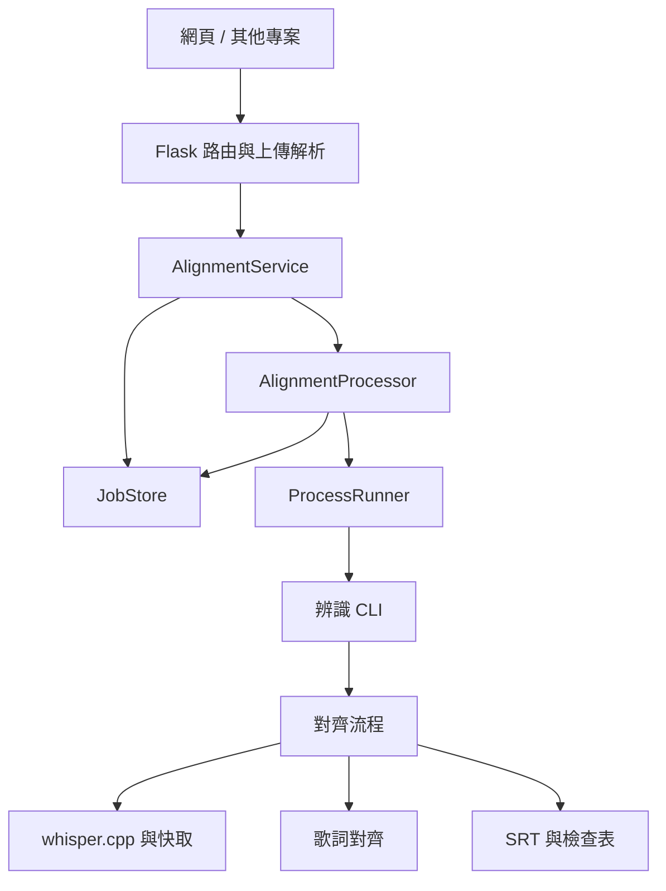

# LyricFlow 架構

Flask 負責網頁與 HTTP API；歌曲辨識、工作生命週期及檔案儲存由各自的模組處理。
`app.py` 提供網頁與 API 啟動入口，`lyric_flow.py` 提供字幕 CLI。
中英文安裝與使用說明見 [README.md](README.md) 與 [README.en.md](README.en.md)。

手動觸發的自動補辨識由 `repair.py` 負責：依已定位句子找出缺漏片段，重新辨識後只合併未定位行。
HTTP 層僅接收時間修正；`validation.py` 驗證順序與範圍，`service.py` 建立新的工作並保留原結果，
`processor.py` 透過 CLI 的 `--retry-from` 執行。取消與進度沿用原本工作機制。
音檔為不可變的上傳來源，補辨識優先以硬連結共用；檔案系統不支援時才複製。

## 模組與責任

| 模組 | 責任 |
| --- | --- |
| `lyricflow/factory.py` | `create_app()` 組裝 Flask、服務與設定，統一 HTTP 錯誤及回應標頭 |
| `lyricflow/routes.py` | API／網頁 Blueprint，將請求交給服務並回傳 JSON 或檔案 |
| `lyricflow/uploads.py` | 解析表單與檔案、檢查欄位；音訊大檔由 Werkzeug 暫存 |
| `lyricflow/validation.py` | 驗證兩種上傳方式共用的 `JobInput` |
| `lyricflow/service.py` | 建立、上傳、啟動、取消、等待與關閉工作的應用流程 |
| `lyricflow/job_store.py` | 原子寫入工作 JSON、執行緒同步、還原結果與工作名額 |
| `lyricflow/process_runner.py` | 執行本機子程序、讀取紀錄，取消時停止整個程序群組 |
| `lyricflow/processor.py` | 轉換音訊、執行辨識 CLI，將進度與結果更新至工作儲存層 |
| `lyricflow/pipeline.py` | 組合辨識、歌詞對齊、局部重試及輸出流程 |
| `lyricflow/repair.py` | 針對未定位片段重新辨識，保留已定位與手動設定的時間 |
| `lyricflow/recognition.py` | whisper.cpp 呼叫、PCM 準備、辨識快取 |
| `lyricflow/lyrics.py`、`alignment.py` | 歌詞清理與文字／同音字順序對齊 |
| `lyricflow/subtitles.py` | SRT 時間格式、字幕與檢查表輸出 |
| `lyricflow/progress.py` | CLI 與背景工作共用的進度事件格式 |
| `lyricflow/config.py`、`errors.py` | 集中設定、限制與不依賴 HTTP 的應用錯誤 |
| `lyricflow/server.py`、`cli.py` | 服務啟停及命令列參數 |
| `lyric_flow_client.py` | 可獨立複製到其他專案的 Python API 客戶端 |
| `scripts/setup.py` | 驗證官方下載檔案、建立 CPU 引擎及安裝模型，清理編譯暫存 |



`factory.py` 是唯一的組裝位置。路由不直接建立執行緒或啟動辨識程序；服務與辨識模組不匯入 Flask／Werkzeug。
錯誤在所屬層產生，再由 HTTP 層轉成狀態碼；預期處理失敗會成為工作的 `error` 狀態，詳細例外留在本機紀錄。
沒有引入資料庫、分散式佇列或額外依賴注入框架。

## 工作狀態與取消

- 每個 Flask app 都有自己的 `JobStore` 與 `AlignmentService`，沒有全域可變工作清單。
- 建立工作的檢查與名額保留在同一把鎖內，一次僅接受一首。
- 同一個工作只能有一個音訊上傳者；上傳先寫 `.partial`，完整後才原子更名。
- 完成、失敗與取消都是終止狀態，遲到的進度或完成事件不能覆蓋它們。
- 同步 API 使用條件變數等待結果，不用忙碌輪詢占用 CPU。
- 取消會停止子程序群組；關閉服務會取消工作、喚醒等待中的請求並等待背景執行緒結束。
- 外部拿到的是狀態副本，不能經由修改巢狀結果改寫內部工作資料。

狀態與上傳資料留在 `.cache/interface/<job_id>/`，已完成結果可在重啟後繼續下載；舊版 JSON 仍可讀取。
辨識快取使用音訊內容與辨識設定的雜湊，處理過程不改寫使用者提供的來源音檔或歌詞。

服務採用**單一伺服器程序、多個 HTTP 執行緒、一個辨識工作**，符合目前單機用途。
請以 `.venv/bin/python app.py` 執行；若未來改成多程序部署，需先將工作名額與狀態改成程序間共用。

## 前端

前端採用從 `video_visual` 整合的 Vue 3、TypeScript 與 Vite，原始碼位於 `web/src/`，字型與場景資源位於 `web/public/`。
`npm ci` 安裝前端相依套件，`npm run build` 產生 `web/dist/`；Flask 首頁與靜態路由只提供此建置目錄中的檔案，不公開原始碼或專案設定。缺少建置時回傳 503 並提示建置指令。

新版提供影音編輯、字幕時間軸、手動對時與錄影匯出。右上角自動辨識彈窗經 `useAutoRecognition` 呼叫健康檢查、建立工作、上傳音訊、輪詢及取消 API，成功後依音軌位置與裁切範圍套用 SRT。既有字幕先確認取代，取消確認不送出工作；處理失敗或取消不覆寫字幕。前端細節見 [web/README.md](web/README.md)。

內建字型與場景由本機提供；已移除外部 Google Fonts 請求。CSP 允許 Vue 動態樣式與本機素材 blob URL，腳本仍限同源。
Python 使用 Ruff；前端使用 Prettier、ESLint、vue-tsc、Vitest 與 Playwright。`scripts/check.py` 會在 HTTP 測試前建置新版前端。

## 安裝與本機資料

`requirements.txt` 固定執行時相依版本，`requirements-dev.txt` 加入 Ruff，
`requirements-build.txt` 提供僅編譯時需要的 CMake。
`scripts/setup.py` 將引擎安裝至 `.local/bin/whisper-cli`，模型放在 `.local/models/`，
引擎授權文字保留於 `.local/licenses/`；原始碼下載及編譯目錄放在系統暫存區並於結束後移除。
這些本機產物與 `.venv/`、`node_modules/`、`.cache/`、使用者素材均由 `.gitignore` 排除。

## 開發與驗證

```sh
.venv/bin/python -m pip install -r requirements-dev.txt
npm ci
.venv/bin/python scripts/check.py
```

檢查內容包含：格式、Python 靜態檢查、純函式測試、Flask 工廠隔離、並發工作限制、取消與重啟，
以及 HTTP 輸入驗證。測試服務使用暫時連接埠與獨立工作資料夾，結束時自動關閉並清理測試上傳檔案。
工作資料夾可透過 `app.py --jobs-dir 路徑` 設定，預設維持 `.cache/interface`。

專案不保留私人歌曲與字幕成果。7 項需要真實歌曲的整合測試預設略過；要執行時，
以 `LYRIC_FLOW_TEST_FIXTURES` 指定外部資料夾，其中放入 `song.wav`、UTF-8 `lyrics.txt`
及預先用目前程式產生的 `expected.srt`。音檔需為至少 115 秒的 PCM WAV，
25–47 秒片段需包含可辨識的演唱，供壓縮格式與即時進度測試使用。
先用 CLI 產生基準並建立辨識快取，再執行完整檢查：

```sh
.venv/bin/python lyric_flow.py /path/to/fixtures/song.wav /path/to/fixtures/lyrics.txt --output /path/to/fixtures/generated
cp /path/to/fixtures/generated/song.draft.srt /path/to/fixtures/expected.srt
LYRIC_FLOW_TEST_FIXTURES=/path/to/fixtures .venv/bin/python scripts/check.py
```

若已指定素材資料夾但檔案缺漏，測試會回報失敗。辨識快取仍可重用。

日常格式化：

```sh
.venv/bin/ruff check --fix .
.venv/bin/ruff format .
npm run format
```

Flask 用法依據官方的 [Application Factories](https://flask.palletsprojects.com/en/stable/patterns/appfactories/)
與 [Uploading Files](https://flask.palletsprojects.com/en/stable/patterns/fileuploads/) 文件。

## 效能與回歸檢查

字幕多選以 Set 查找，避免每句字幕反覆線性掃描全部選取項目；框選集合沒有改變時不重新發佈選取狀態。影音同步以單次掃描選擇最晚開始的有效畫面片段，維持相同開始時間的原順序，並快取影片素材清單。

草稿使用 IndexedDB `resonance-projects` v2，`drafts/current` 保存清單與版本，`media` 分開保存原始 File。編輯停止 900 ms 後寫入，持續編輯最多等待 5 秒；匯入、辨識等忙碌期間暫停。交易原子更新清單、新增素材並刪除未引用素材，字幕／設定編輯不重寫既有媒體。版本比對防止多分頁靜默覆寫或復活已刪除草稿；重置先停止排程並等候進行中的寫入再刪除，只保留不含作品內容的版本識別碼以阻擋舊分頁的延遲寫入。支援恢復 v1 的封裝草稿；載入時先詢問使用者選擇，不自動恢復。草稿只保留最新一份，空間不足時保留前次成功內容並提示重試；重要作品仍可手動下載專案備份。自動辨識的讀取／上傳請求可中止，連線請求有 30 秒等待上限；取消後即使後端停止失敗，也不套用稍後回傳的結果。

Flask 對帶內容雜湊的 JS／CSS 設定一年瀏覽器快取；字型與場景依 ETag 重新驗證。HTML、API、私人音訊與錯誤回應維持 `no-store`，避免沿用舊首頁或快取私人工作資料。

`.venv/bin/python scripts/check.py --browser` 會建置前端，在獨立暫時服務依序執行後端及 Chrome 回歸測試，結束時自動關閉服務。需要 Google Chrome；不加 `--browser` 維持原本的快速檢查流程。直接匯入 TypeScript 原始碼的場景測試仍透過 Vite 的 `npm run test:e2e` 執行。
